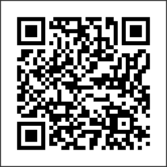

# Introducción al Procesamiento Lenguaje Natural, enfoque Clínico.
Introducción al Procesamiento de lenguaje Natural, un enfoque Clínico presentación para la UTSnomed-CT.es
# PLN-Clinical
**Unidad Técnica de Snomed-CT España**.

Acceso a la Presentación: <a href="https://nachuss.github.io/plnclinical/#/">Introducción al PLN Clínico</a>

Dentro del Grupo de Trabajo de la *UTSnomed-CT.es* , se ha preparado una presentación para que se conozca la evolución del PLN y los nuevos enfoques existentes en la actualidad.

Puedes acceder a la presentación directamente en tu movil, mediante este QR.
</img>
